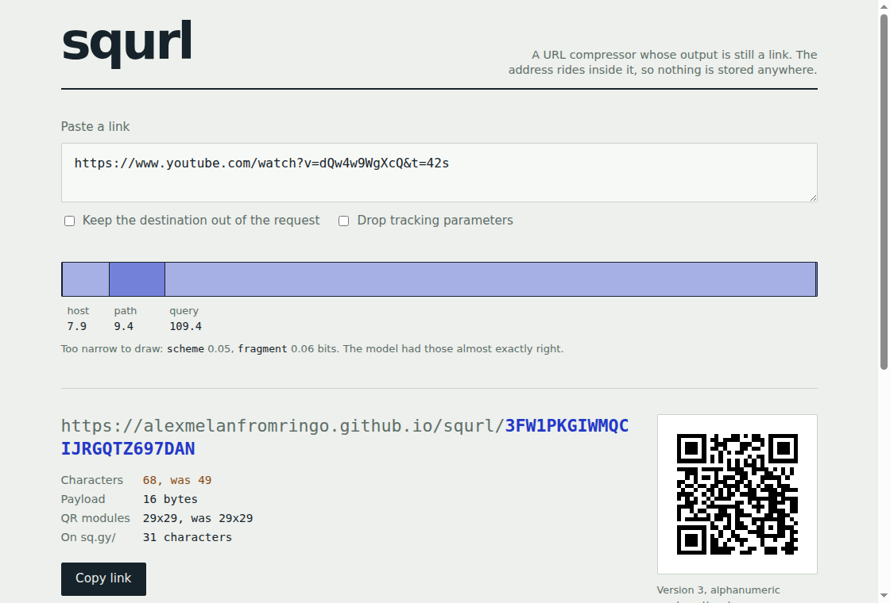

<h1 align="center">squrl</h1>

<p align="center">
  <b>A URL compressor whose output is still a link.</b><br>
  Not a shortener — nothing is stored anywhere, because the address travels
  inside the link itself.
</p>

<p align="center">
  <a href="https://github.com/AlexMelanFromRingo/squrl/actions/workflows/test.yml"></a>
  
  
  
</p>

<table align="center">
<tr>
  <td align="center"></td>
  <td align="center"></td>
</tr>
<tr>
  <td align="center"><sub>the URL<br><b>118 characters &middot; 41&times;41</b></sub></td>
  <td align="center"><sub>the same URL, compressed<br><b>74 characters &middot; 29&times;29</b></sub></td>
</tr>
</table>

<p align="center"><sub>Same destination, half the modules. Both codes were drawn by this repository.</sub></p>

---

## Try it

**[alexmelanfromringo.github.io/squrl](https://alexmelanfromringo.github.io/squrl/)** — compresses in the tab, sends nothing anywhere.

<p align="center">
  
</p>

<p align="center"><sub>The bar is the point: every part of the URL takes as much width as it costs.
The scheme is too narrow to draw at 0.05 bits.</sub></p>

```bash
git clone https://github.com/AlexMelanFromRingo/squrl
cd squrl && npm link          # nothing to install: dependencies is {}

squrl 'https://www.youtube.com/watch?v=dQw4w9WgXcQ&t=42s'
# https://sq.gy/3FW1PKGIWMQCIJRGQTZ697DAN

squrl expand https://sq.gy/3FW1PKGIWMQCIJRGQTZ697DAN
# https://www.youtube.com/watch?v=dQw4w9WgXcQ&t=42s

squrl qr 'https://example.com/some/page'     # draws it in the terminal
squrl explain 'https://example.com/x?a=1'    # where every bit went
squrl bench                                  # measured, on unseen URLs
```

## The idea

A URL is not text. It is a structure that happens to be written as text, and
almost every character in it is predictable.

```
https://www.youtube.com/watch?v=dQw4w9WgXcQ
^^^^^^^^                                       8 characters … or one bit
```

There are two schemes worth having. One bit tells them apart — and once a model
knows that most links are `https`, that bit costs **0.05 bits**, because that is
what arithmetic coding does with a decision you were already sure about. `www.`
is another flag. `youtube.com` is an index into a list. `/watch` is a word.

What is left is `dQw4w9WgXcQ`, and eleven random characters are eleven random
characters. Nothing compresses those. Any tool that claims to is storing them in
a database and handing you a receipt.

```console
$ squrl explain 'https://www.youtube.com/watch?v=dQw4w9WgXcQ&t=42s'
https://www.youtube.com/watch?v=dQw4w9WgXcQ&t=42s
49 characters, 392 bits as text

  scheme      0.05 bits
  host         7.9 bits  ##
  path         9.4 bits  ###
  query      109.4 bits  ###################################
  fragment    0.06 bits
  --------- -----------
  total      126.8 bits  -> 16 bytes

  link  https://sq.gy/3FW1PKGIWMQCIJRGQTZ697DAN
        39 characters, 20% shorter
```

Eight bits for `https://www.youtube.com`, nine for `/watch`, and a hundred and
nine for the query. That last number is not a failure: `dQw4w9WgXcQ` is eleven
characters from an alphabet of 64, which is 66 bits of genuine randomness, and
no model gets those for free.

## Not a shortener

|  | bit.ly and friends | squrl |
|---|---|---|
| where the URL lives | in their database | in the link |
| when the service dies | every link dies | run the code; links still work |
| expiry | their policy | there is nothing to expire |
| who sees your links | they do, plus their analytics | whoever runs the redirector — or nobody, see below |
| the same URL twice | two rows, maybe two links | byte-identical link, always |
| offline | impossible | `squrl expand` needs no network |

## Opening one

A phone camera reads URLs. It cannot decompress one — it has never heard of this
format, and it will not install anything. So something has to turn the payload
back into an address. There are three somethings, and none of them stores
anything:

**Static hosting.** `index.html` and `404.html` in this repository are the whole
service. A static host serves `404.html` for any path it does not have, which is
every squrl link; the page decompresses the payload in the tab and goes there.
GitHub Pages, Netlify, an S3 bucket, a folder behind nginx — all sufficient.

**A fragment, and no request at all.** `sq.gy/#PAYLOAD` puts the payload after
the `#`, which browsers never send to the server. The host learns nothing about
where you went; it only serves the same page it serves everyone. The cost is a
bigger QR code, because `#` is outside the character set QR codes have a cheap
mode for — so this is the form for pasting, and the path form is the form for
printing.

**A real server**, if you want redirects, caching and `Location` headers:

```bash
npm start                          # server/redirect.js, listens on :8787
wrangler deploy server/worker.js   # or any edge runtime — there is no I/O to do
```

```
GET /3FW1PKGIWMQCIJRGQTZ697DAN            301, Location: the original URL
GET /3FW1PKGIWMQCIJRGQTZ697DAN?preview    a page showing where it goes
GET /health                               ok
```

The redirect is `301` with `max-age=31536000, immutable`, because the mapping is
arithmetic rather than a routing decision: that payload has always meant that
URL and always will.

## How much smaller

`npm run bench`, on `tools/holdout.txt` — 74 URLs the model was deliberately
**not** trained on:

|  | original | compressed |  |
|---|---:|---:|---:|
| characters | 4093 | 3499 | **85%** |
| payload bytes | 4093 | 1580 | **39%** |
| QR modules | 72850 | 54586 | **75%** |

59 of 74 links came out shorter as text. 65 needed a smaller QR version, 9 came
out the same size, none got bigger.

Those two numbers — 39% and 85% — are the honest shape of the thing. The
*compression* is better than two to one. The *link* is only 15% shorter, because
`https://sq.gy/` is fourteen characters of overhead and base36 costs 1.55
characters per byte. On short URLs that eats the entire win:

| original URL | count | characters | QR modules |
|---|---:|---:|---:|
| under 40 chars | 16 | 93% | 81% |
| 40–60 chars | 28 | 89% | 76% |
| 60–90 chars | 28 | 84% | 74% |
| over 90 chars | 2 | 57% | 56% |

**Under about 35 characters, don't bother.** squrl will hand you back something
longer, and say so. Where it earns its keep is the kind of link people actually
paste at each other:

| URL | before | after | QR |
|---|---:|---:|---|
| `https://www.youtube.com/watch?v=kJQP7kiw5Fk&t=90s` | 49 | 39 | v3 29² byte → v2 25² alnum |
| `https://ru.wikipedia.org/wiki/%D0%9A%D0%BE%D0%B4_…` | 97 | 42 | v5 37² byte → v2 25² alnum |
| `https://tracker.example.net/c?utm_source=facebook…` | 126 | 84 | v6 41² byte → v4 33² alnum |

The Cyrillic one is the clearest case: percent-encoded UTF-8 spends three
characters per byte, and squrl decodes it back to bytes before coding it. 97
characters become 42, and the QR drops from 1369 modules to 625.

## How it works

**1. Split, losslessly.** `src/parse.js` cuts the URL into scheme, userinfo,
host, port, path, query and fragment, and guarantees `join(split(url)) === url`
byte for byte. Nothing is normalised — not a default port, not a trailing slash,
not the case of a percent escape — because a compressor that tidies your URL
hands back a link to a different page.

**2. Describe it as decisions.** `src/model.js` turns the parts into binary
questions: *is it https? is the host in the list? which index? is this segment a
word, a number, a hash, an identifier, a filename, percent-escaped text?* Each
piece is encoded **every way that fits**, against a copy of the model, and only
the cheapest is written. The shape travels in the stream, so the decoder is told
rather than guessing.

**3. Price the decisions.** `src/rc.js` is a binary range coder. Expected
decisions cost a fraction of a bit; surprising ones cost several. The starting
probabilities live in `src/prior.js`, fitted by `npm run train` over
`tools/corpus.txt` — one short URL gives an adaptive model nothing to adapt to,
so the priors have to arrive already knowing what URLs look like.

**4. Write it in base36.** The alphabet is a QR decision, not an aesthetic one:

| encoding | chars per byte | QR bits per byte |  |
|---|---:|---:|---|
| base64url | 1.33 | 10.7 | shortest as text, but drops the QR into byte mode |
| base32 | 1.60 | 8.8 | fine, and 3% longer than it needs to be |
| **base36** | **1.55** | **8.5** | what squrl uses |

A QR code has an *alphanumeric* mode covering `0-9 A-Z` that packs two
characters into eleven bits — 5.5 bits each against byte mode's 8 — and a single
lowercase letter anywhere in the link forces the whole symbol out of it. So the
payload is uppercase, and the prefix is written uppercase too.

**Then it checks its own work.** `pack()` decodes its own output and compares it
to the input; if anything differs at all it throws the result away and re-encodes
the URL as one run of plain text, which always round-trips. Being wrong about a
URL must cost bytes, never correctness.

### The QR encoder

`src/qr.js` is a QR encoder written from scratch — Reed–Solomon over GF(256),
the four masking penalty rules, format and version BCH, versions 1 to 20 at all
four error correction levels. It exists because "the QR code is smaller" is a
claim, and a claim needs a measurement.

Almost nothing in it is tabulated: the module layout is built, the codeword
capacity is counted off that layout, and the block structure follows from two
numbers per version. Which leaves plenty of room to be wrong, so
`tools/qr-check.mjs` compares every symbol it can produce — 20 versions × 4
levels × 3 masks — against an independent implementation, module for module:

```
matched 240 of 240
```

That check found both bugs that survived the first draft: format information is
written most significant bit first, and the module at (n−8, 8) is not a format
bit at all — it is the dark module, and writing over it produces a symbol that
looks perfect and scans as nothing.

## Tracking parameters

The single biggest win available is not compression:

```console
$ squrl 'https://www.ozon.ru/product/…-9876543210/?utm_source=yandex&utm_medium=cpc&utm_campaign=autumn'
https://sq.gy/EWE74NGMQJVF38L2022TKB3WGJ4XZL31QYM3SKJWFECY3U2WC37T6JNO4ICY
118 chars -> 74 (39 bytes of payload, -44 chars)

$ squrl --strip-tracking 'https://www.ozon.ru/product/…-9876543210/?utm_source=yandex&utm_medium=cpc&utm_campaign=autumn'
dropped 3 tracking parameter(s): utm_source=yandex utm_medium=cpc utm_campaign=autumn
https://sq.gy/1XTX9LTIS2O0QUFBOP8WE6XRLUD5ORFMG51J6XQUZZ
65 chars -> 56 (27 bytes of payload, -9 chars)
```

Three campaign parameters were 53 of that URL's 118 characters, and 12 of the 39
bytes they compressed to. Dropping them is **off by default and always
announced**, because it changes the URL — the one place squrl will do that.

## Compatibility, honestly

The dictionaries in `src/dict.js` and the priors in `src/prior.js` are **part of
the wire format**, not tuning knobs. Change either and old payloads decode to
something else — silently, since a range coder has no checksum to fail. If you
retrain on your own corpus:

- links made before the retraining stop meaning what they meant;
- so bump `VERSION` in `src/model.js`, and keep the old tables if you need both.

The format leaves room for that: the version is two bits, where `3` means "a
number follows", so there is no cliff at version four.

Two more things worth saying plainly. A payload is **not encrypted** — anyone
holding this library can read it, and that is the point. And whoever hosts the
redirector sees the traffic, unless you use the fragment form; that is inherent
to being the host a camera dials, which is why the whole thing is a handful of
dependency-free files you can run yourself.

## Tests

```bash
npm test        # 60 tests, node:test, no framework
```

The ones that matter are the round trips: every URL in the corpus, every URL in
the holdout, a list of deliberately awkward ones (`?` with no query, `#` with no
fragment, `//` inside a path, lowercase percent escapes, IPv6 literals, raw
Cyrillic, 2000 characters of path), and 2000 URLs assembled from random pieces —
all compared byte for byte. Then 5000 random payloads thrown at the decoder to
check it refuses them cleanly instead of allocating the world, and 4000 more at
the redirector to check nothing reaches a `Location` header that should not.

That last test exists because fuzzing the running server turned up a payload
that decoded to a URL containing a newline. In a `Location` header, that is
header injection.

## Prior art

**[p2r3/ha.mr](https://github.com/p2r3/ha.mr)** got there first, and got two
things right that this project took from it: a static host serving `404.html`
is a complete redirector, and a payload in the fragment never reaches the server
at all. It compresses with Huffman-coded dictionaries built from real link
datasets, and fits each segment to the narrowest character set that covers it —
an idea worth stealing next, since squrl currently spends a flat six bits on
every identifier character where a lowercase-only alphabet would spend 5.25.

The differences are in the middle layer: squrl codes arithmetically rather than
with Huffman codes, so a decision can cost a fraction of a bit; its starting
probabilities are fitted to a corpus and shipped; and it encodes each piece
several ways to keep the cheapest.

## License

MIT.
